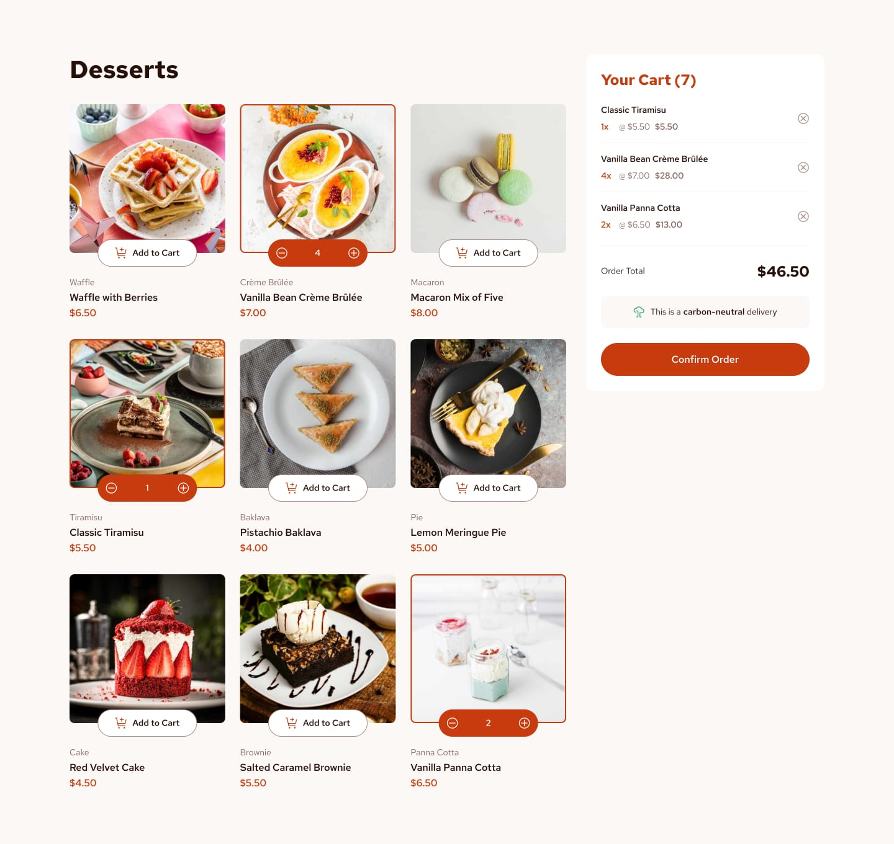

# Frontend Mentor - Product list with cart solution

This is a solution to the [Product list with cart challenge on Frontend Mentor](https://www.frontendmentor.io/challenges/product-list-with-cart-5MmqLVAp_d). Frontend Mentor challenges help you improve your coding skills by building realistic projects. 

## Table of contents

- [Overview](#overview)
  - [The challenge](#the-challenge)
  - [Screenshot](#screenshot)
  - [Links](#links)
  - [Built with](#built-with)
- [Author](#author)

## Overview

### The challenge

Users should be able to:

- Add items to the cart and remove them
- Increase/decrease the number of items in the cart
- See an order confirmation modal when they click "Confirm Order"
- Reset their selections when they click "Start New Order"
- View the optimal layout for the interface depending on their device's screen size
- See hover and focus states for all interactive elements on the page

### Screenshot

### Links

- Solution URL: [solution](https://www.frontendmentor.io/solutions/rock-paper-scissors-using-react-cs2SvI9ubV)
- Live Site URL: [site](https://rock-paper-scissors-steel-rho.vercel.app/)

## My process

### Built with

- Semantic HTML5 markup
- CSS custom properties
- Flexbox
- CSS Grid
- Mobile-first workflow
- [React](https://reactjs.org/) - JS library

## Author

- Website - [CV](https://cv-frontend-mocha.vercel.app/)
- Frontend Mentor - [@Maxim-Pv](https://www.frontendmentor.io/profile/Maxim-Pv)
- Linked in - [@Maxim_Pavlov](https://www.linkedin.com/in/maksim-pavlov-12b22528b/?locale=en_US)

